# Guida utente GIS e QGIS

**GAIA · Consorzio di Bonifica dell'Oristanese**  
Versione 1.0 · 7 ottobre 2026

Questa guida accompagna l'operatore nella consultazione delle mappe GAIA e
nell'apertura del progetto QGIS. Le funzioni di amministrazione, import e
pubblicazione sono riservate agli utenti tecnici.

## 1. Prima di iniziare

Servono un account GAIA attivo, il modulo **GIS** abilitato e un browser aggiornato. Per QGIS serve anche la configurazione personale autorizzata dal responsabile IT. Non condividere password, token GAIA o il database delle credenziali QGIS.

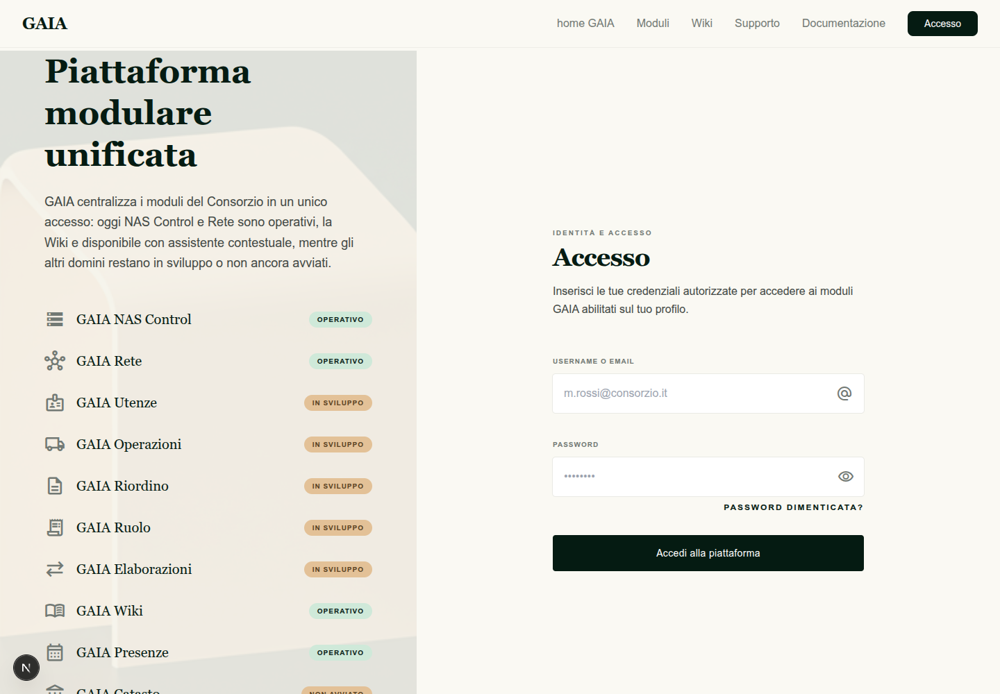

Apri `http://gaia.lan:8080` (o l'indirizzo comunicato dall'amministratore), inserisci username e password e seleziona **Accedi alla piattaforma**. Dopo l'accesso, nella barra superiore deve comparire **GIS Platform**.

## 2. Catalogo delle mappe

Dal menu **GIS Platform → Catalogo mappe** si apre il catalogo centrale.

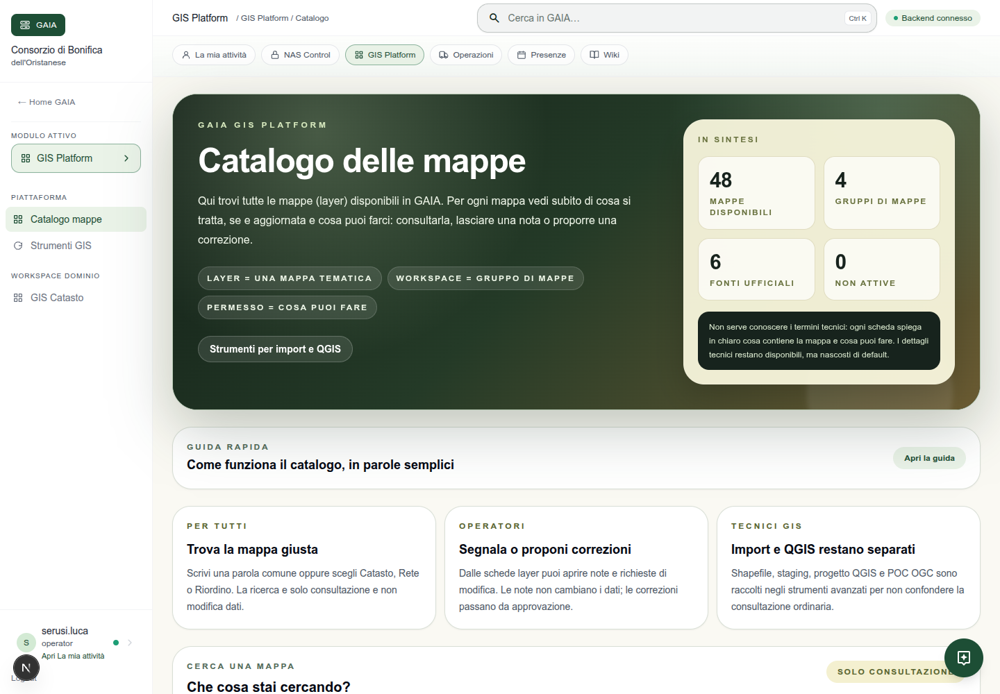

La pagina mostra il numero di mappe disponibili e i gruppi. Cerca usando una parola comune, per esempio `distretti`, `particelle` o `condotte`, oppure filtra per **Catasto**, **Rete** o **Riordino**.

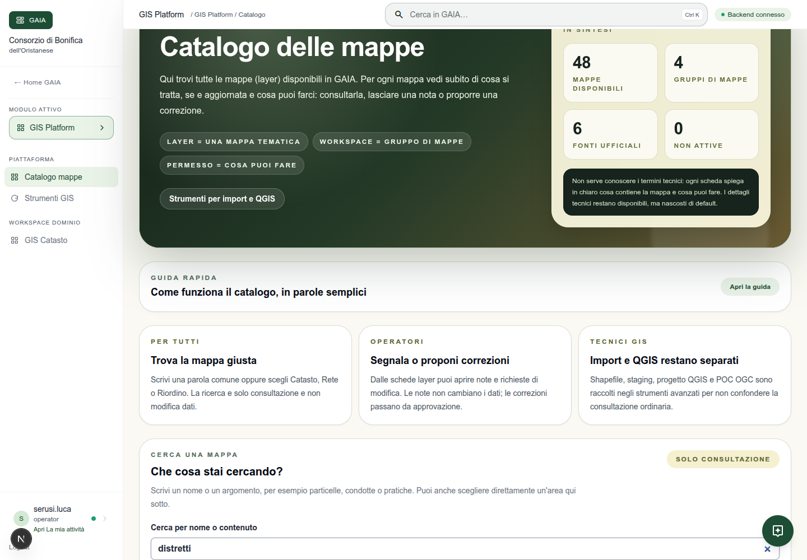

Ogni scheda indica la fonte e il permesso effettivo: **Puoi consultare** permette di vedere la mappa; **Puoi aggiungere note** permette una segnalazione; **Puoi proporre modifiche** apre una richiesta soggetta ad approvazione. La consultazione del catalogo non modifica i dati.

## 3. Aprire una mappa

Seleziona una scheda e premi **Apri mappa**. La mappa si apre con lo sfondo OpenStreetMap e i controlli `+`, `−` e nord.

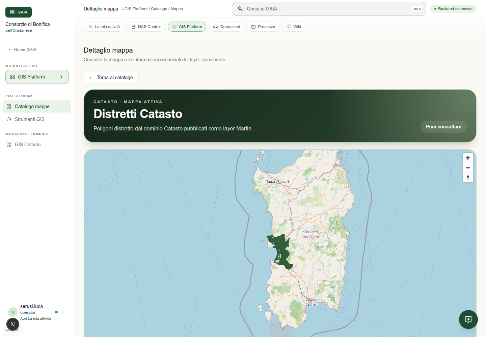

Usa il mouse per spostarti e la rotella per lo zoom. La mappa dei distretti è una fonte PostGIS ufficiale di GAIA; le mappe territoriali RAS e AdE sono indicate separatamente come fonti esterne.

Per le **Condotte irrigue**, il catalogo mostra il layer operativo previsto per la rete. I dati ufficiali devono essere pubblicati dopo la revisione dei file consegnati dai referenti: non usare copie locali o shapefile non approvati come sorgente ufficiale.

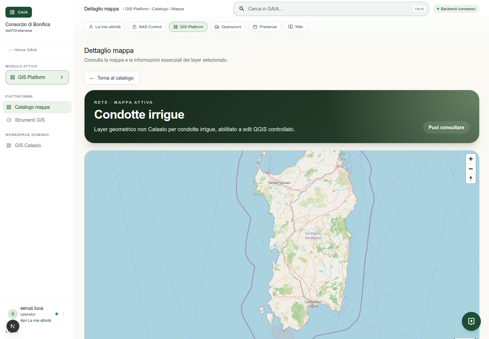

Apri **Informazioni tecniche della mappa** per leggere sorgente, geometria, sistema di coordinate, tabella e campo identificativo.

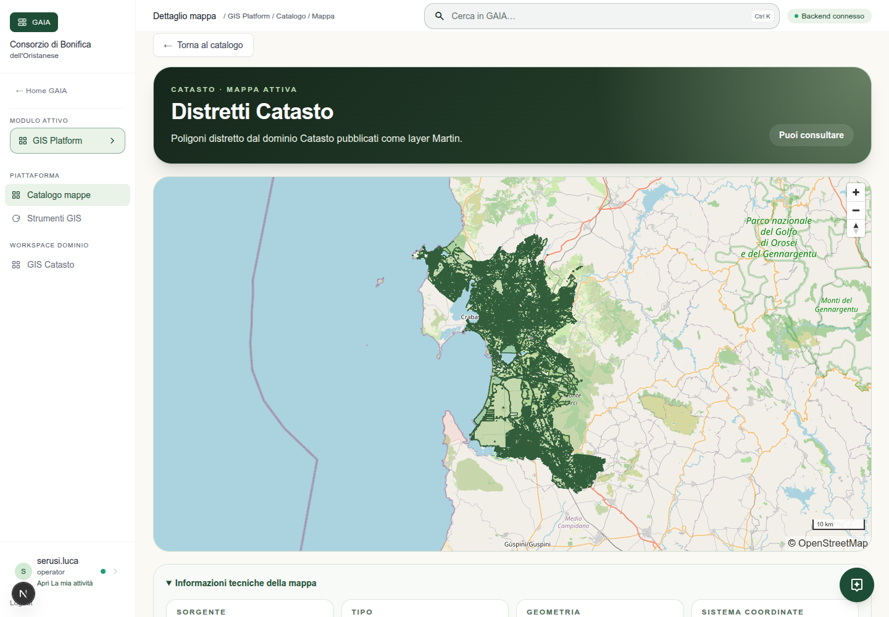

## 4. GIS Catasto: ricerca e strumenti

Per cercare particelle, distretti e contesto territoriale apri **Catasto → GIS**. La pagina contiene la mappa operativa e i comandi **Cerca**, **Misure**, **Stampa**, **Sfondo**, **Vista estesa** e **Apri Console GIS**.

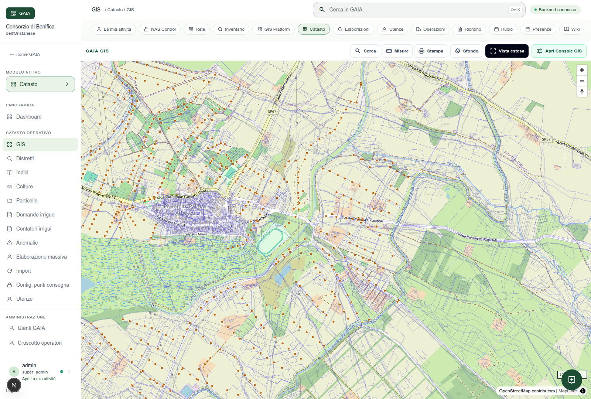

La ricerca consente di orientarsi nel comprensorio. La console mostra i risultati e consente di applicare i filtri. Seleziona una particella per aprire il dettaglio e, quando abilitato, la scheda territoriale.

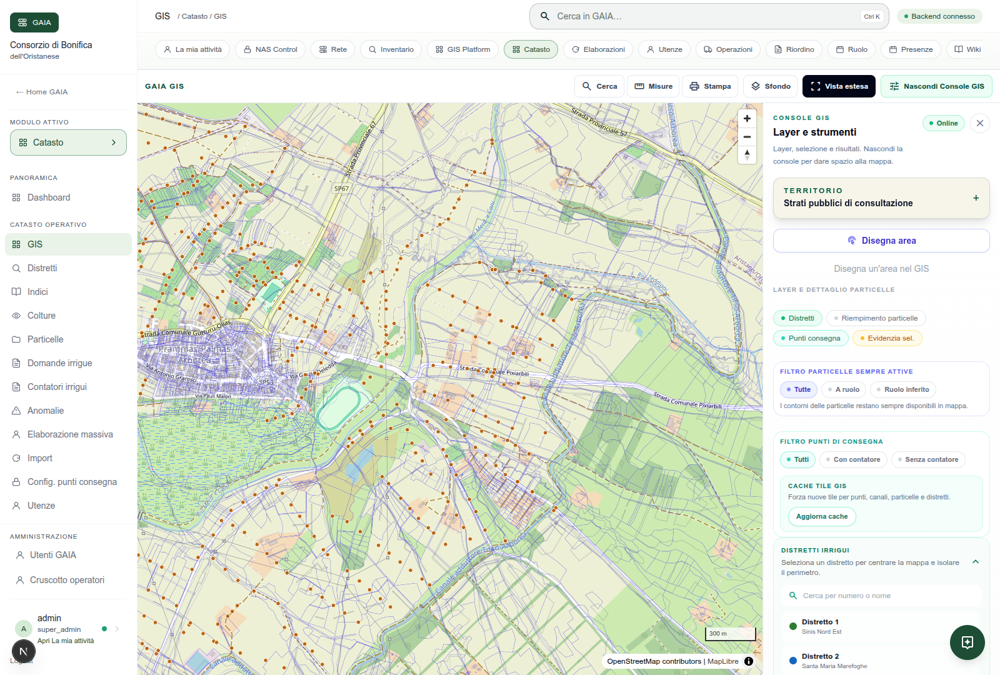

**Misure** calcola distanze e aree a scopo operativo. **Stampa** prepara una stampa della vista corrente. Le misure e la scheda territoriale sono strumenti di consultazione e non sostituiscono un rilievo o una certificazione.

## 5. Sorgenti territoriali esterne

Nel pannello degli strati territoriali puoi attivare o disattivare i layer RAS, AdE e le ortofoto autorizzate. Leggi sempre l'attribuzione mostrata dal pannello. Un layer può risultare `disabled`, `unreachable`, `ok` o `empty`: `empty` significa che non è stato trovato un elemento nel punto interrogato, non che GAIA sia guasto.

L'interrogazione puntuale parte con un'azione esplicita sulla mappa. GAIA separa i risultati del Catasto, delle fonti ufficiali esterne e delle sorgenti territoriali.

## 6. Scaricare il progetto QGIS

Gli utenti tecnici aprono **GIS Platform → Strumenti GIS** e selezionano **Scarica progetto QGIS**.

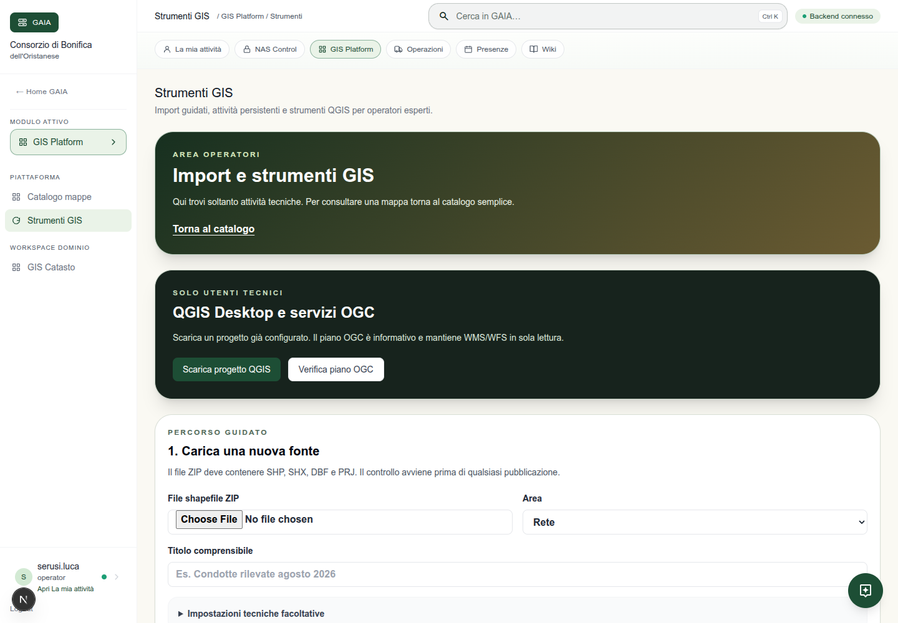

Il download produce `gaia-gis-platform.qgz`. Il progetto include solo layer attivi e visibili all'utente, oltre ai layer territoriali autorizzati. Non contiene password o token.

## 7. Aprire il progetto in QGIS

1. Avvia QGIS Desktop.
2. Apri `gaia-gis-platform.qgz` con **Progetto → Apri**.
3. Quando richiesto, inserisci le credenziali personali PostgreSQL assegnate dall'amministratore.
4. Per i layer territoriali configura in QGIS l'autenticazione `gaia_oauth` con la tua credenziale GAIA personale.
5. Controlla il pannello **Layer**: i gruppi corrispondono ai workspace GAIA.
6. Verifica che i layer Catasto risultino in sola lettura.

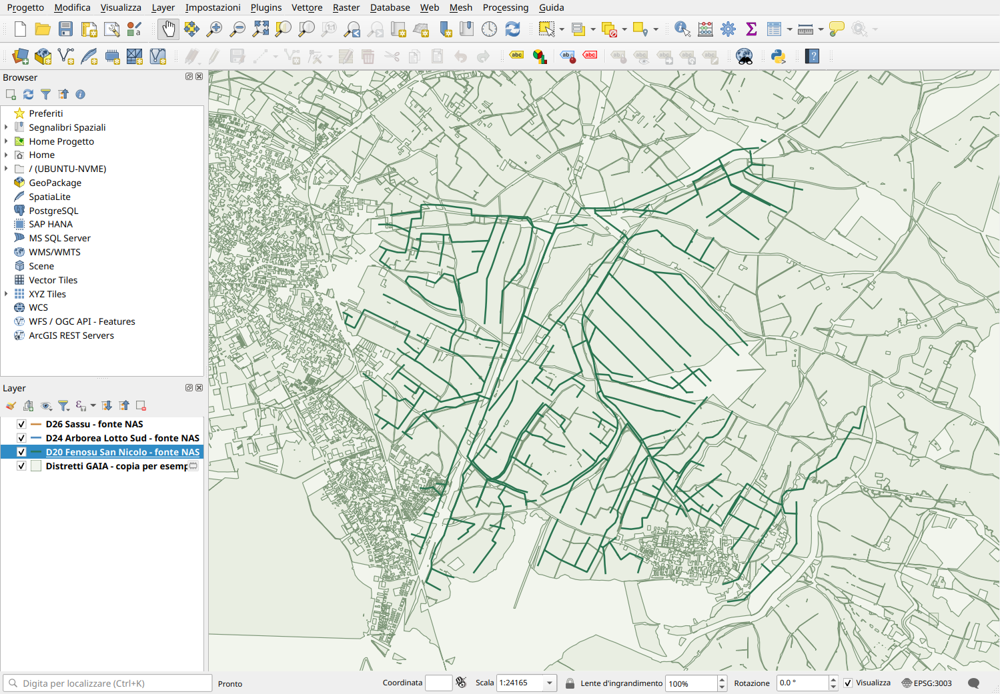

Il progetto utilizza il CRS indicato dalla sorgente. Non cambiare il CRS o assegnare EPSG a un file senza `.prj`: chiedi al referente GIS.

## 8. Consultare attributi e selezioni in QGIS

Seleziona un layer nel pannello, usa **Zoom al layer** e attiva **Identifica elementi** per leggere una geometria. Con il tasto destro sul layer apri **Tabella attributi**.

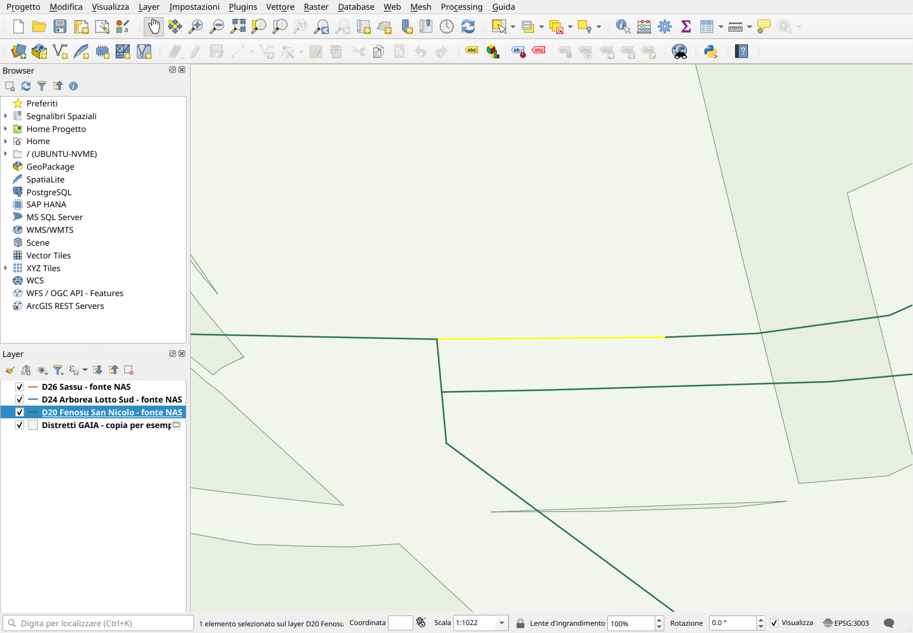

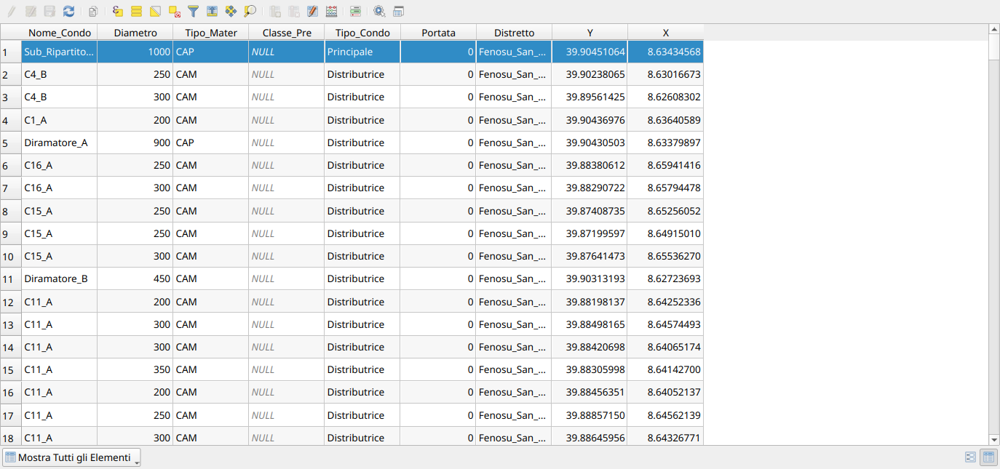

Nei file condotte i campi possono includere `Nome_Condo`, `Diametro`, `Tipo_Mater`, `Tipo_Condo`, `Distretto` e `Nume_Distr`. Un valore vuoto resta vuoto: non trasformarlo manualmente in zero o in un codice inventato.

## 9. Regole per le condotte NAS

I file della cartella NAS sono una fonte in revisione. Prima dell'import GAIA devono essere confermati referenti, revisione, CRS e mapping degli attributi. Sono state rilevate copie geometriche tra file generali e file `Imp_*`, oltre a nomi e diametri mancanti e due geometrie problematiche nel file Sassu.

Non modificare gli shapefile sul NAS. Non importare direttamente in una tabella ufficiale. Il percorso corretto è: staging GAIA → anteprima → revisione → change request → approvazione → apply controllato.

## 10. Problemi comuni

**Non vedo GIS Platform**  
Chiedi all'amministratore di abilitare il modulo GIS sul tuo account.

**Vedo la mappa ma non i dati**  
Controlla il banner di health, la connessione di rete e il permesso effettivo della scheda. Non cambiare URL remoti nel progetto QGIS.

**QGIS chiede una password**  
Usa la credenziale personale assegnata. La password non è nel progetto e non deve essere condivisa.

**Un layer esterno è `unreachable`**  
Riprova più tardi e segnala la sorgente indicata. Continua a usare i risultati GAIA disponibili.

**Il progetto QGIS non apre i layer territoriali**  
Verifica `gaia_oauth`, raggiungibilità HTTPS di GAIA e accesso al modulo GIS.

**Una condotta non appare**  
Verifica che il dato sia stato approvato e pubblicato. I file NAS non sono automaticamente dati ufficiali GAIA.

## Assistenza

Quando segnali un problema indica username, pagina, mappa/layer, ora, messaggio visualizzato e screenshot. Non inviare password, token o file con dati personali.
