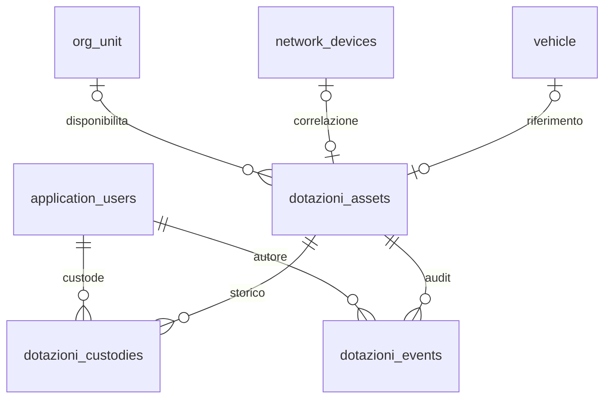

# Dotazioni - relazioni del modello dati

Fonte: metadata SQLAlchemy in `backend/app/modules/dotazioni/models.py` e
migration `20261001_1600_dotazioni.py`. `DOTAZIONI_TABLE_DICTIONARY.md` e
`DOTAZIONI_RELATIONSHIPS.csv` sono generati con le funzioni di
`scripts/generate_data_model_docs.py`, limitando l'export alle tre tabelle
Dotazioni per preservare gli artefatti storici degli altri domini.

Le PK Dotazioni, unita e veicoli sono UUID; utenti e Network usano interi.
I riferimenti sono FK reali; network e vehicle sono univoci se valorizzati.
La cancellazione del bene/custode/unita/mezzo referenziati e protetta dalle
FK: nessuna cancellazione a cascata dello storico.

`inventory_item_id` del link Network legacy non identifica una Dotazione.
`VehicleUsageSession` resta in Operazioni; non alimenta una custodia fisica.
Il codice asset e un identificatore leggibile stabile; la PK resta UUID.
Il flag `module_dotazioni` e aggiunto all'utente con default false.

Le tabelle Dotazioni compaiono nella classificazione residuale del generatore
trasversale corrente; questo supplemento ne esplicita il dominio. I poster
PDF storici non sono rigenerati in questa change.
