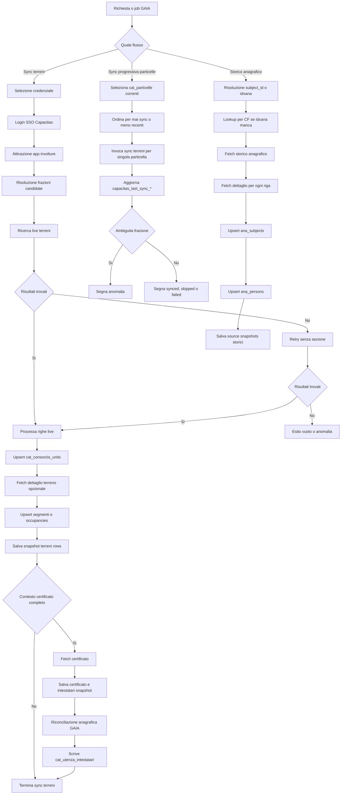

# Flusso Operativo Sync Capacitas

## Scopo

Questo file e una vista sintetica e operativa del flusso Capacitas nel dominio Catasto.

Per il dettaglio completo di tabelle, matching e codice, vedere:

- [CAPACITAS_SYNC_ANALYSIS.md](/home/cbo/CursorProjects/GAIA/domain-docs/catasto/docs/CAPACITAS_SYNC_ANALYSIS.md)

## Flussi principali

In GAIA oggi esistono tre flussi distinti:

1. `sync terreni`
2. `sync progressiva particelle`
3. `import storico anagrafico`

## Diagramma

## 1. Sync Terreni

### Input

Una richiesta tipica contiene:

- comune oppure frazione esplicita
- sezione
- foglio
- particella
- sub opzionale

### Sequenza

1. scelta credenziale attiva
2. login SSO Capacitas
3. attivazione app `involture`
4. risoluzione frazioni candidate
5. ricerca live terreni
6. retry senza sezione se la prima ricerca non trova nulla
7. risoluzione o creazione `cat_consorzio_unit`
8. fetch dettaglio terreno opzionale
9. creazione segmento riordino opzionale
10. creazione o update occupancy
11. salvataggio snapshot riga live
12. fetch certificato se il contesto e completo
13. salvataggio intestatari snapshot
14. tentativo di riconciliazione con anagrafica GAIA
15. scrittura link annuali `cat_utenza_intestatari`

### Output dati

Il flusso scrive soprattutto:

- `cat_consorzio_units`
- `cat_consorzio_unit_segments`
- `cat_consorzio_occupancies`
- `cat_capacitas_terreni_rows`
- `cat_capacitas_terreno_details`
- `cat_capacitas_certificati`
- `cat_capacitas_intestatari`
- `cat_utenza_intestatari`
- snapshot soggetto/persona in anagrafica centrale

## 2. Sync Progressiva Particelle

### Scopo

Questo flusso prende le `cat_particelle` locali e le passa una per una nella pipeline live terreni.

Non crea una logica diversa: orchestration sopra `sync terreni`.

### Selezione particelle

Il job lavora su:

- particelle correnti
- non soppresse
- mai sincronizzate oppure piu vecchie

Può essere limitato a:

- particelle `due`
- un numero massimo di record

### Esiti possibili

Su ogni particella locale il job aggiorna:

- `capacitas_last_sync_at`
- `capacitas_last_sync_status`
- `capacitas_last_sync_error`
- `capacitas_last_sync_job_id`

Stati attesi:

- `synced`
- `skipped`
- `failed`
- `anomalia`

### Caso speciale: frazione ambigua

Se una particella produce risultati validi in piu frazioni:

- il job non sceglie arbitrariamente
- salva anomalia sulla particella
- richiede risoluzione manuale

## 3. Import Storico Anagrafico

### Scopo

Questo flusso non sincronizza il catasto consortile.

Serve a popolare o completare lo storico persona in GAIA partendo da:

- `subject_id` locale
- oppure `idxana`

### Sequenza

1. risoluzione target
2. risoluzione `idxana` se manca
3. ricerca Capacitas per CF se necessario
4. fetch storico anagrafico
5. fetch dettaglio per ogni riga storica
6. creazione o update `AnagraficaSubject`
7. creazione o update `AnagraficaPerson`
8. scrittura snapshot storici come source snapshots

### Output dati

Aggiorna soprattutto:

- `ana_subjects`
- `ana_persons`
- storico snapshot persona sorgente Capacitas

## Regole decisionali chiave

### 1. Il solo CCO non basta

Per certificati, intestatari e link Capacitas il backend considera affidabile il contesto:

- `CCO + COM + PVC + FRA + CCS`

Il solo `CCO` non e trattato come chiave sufficiente.

### 2. Capacitas non sostituisce il master locale

Capacitas oggi e una sorgente di:

- arricchimento
- verifica live
- riconciliazione

Non e il master di:

- `cat_utenze_irrigue`
- `cat_particelle`

### 3. Ambiguita = stop

Se il comune/frazione non e univoco:

- il backend non inventa il match
- il flusso si ferma con anomalia o errore esplicito

### 4. Match con utenza locale

Ordine logico:

1. cerca l’utenza locale con stesso `CCO`, anno e geografia
2. se l’anno non coincide, usa la piu recente con stessa geografia

### 5. Intestatari annuali solo su target affidabile

Se un certificato puo riferirsi a piu utenze locali:

- il backend evita di copiare intestatari su tutte

## Dove guardare quando qualcosa non torna

### Errore login o credenziali

- [backend/app/services/elaborazioni_capacitas.py](/home/cbo/CursorProjects/GAIA/backend/app/services/elaborazioni_capacitas.py:96)
- [backend/app/modules/elaborazioni/capacitas/session.py](/home/cbo/CursorProjects/GAIA/backend/app/modules/elaborazioni/capacitas/session.py:60)

### Problema lookup comune/frazione/sezione

- [backend/app/services/elaborazioni_capacitas_terreni.py](/home/cbo/CursorProjects/GAIA/backend/app/services/elaborazioni_capacitas_terreni.py:1257)

### Problema match particella locale / comune reale

- [backend/app/services/elaborazioni_capacitas_terreni.py](/home/cbo/CursorProjects/GAIA/backend/app/services/elaborazioni_capacitas_terreni.py:1950)

### Problema certificato o intestatari

- [backend/app/services/elaborazioni_capacitas_terreni.py](/home/cbo/CursorProjects/GAIA/backend/app/services/elaborazioni_capacitas_terreni.py:230)
- [backend/app/services/elaborazioni_capacitas_terreni.py](/home/cbo/CursorProjects/GAIA/backend/app/services/elaborazioni_capacitas_terreni.py:305)

### Problema sync progressiva particelle

- [backend/app/services/elaborazioni_capacitas_particelle_sync.py](/home/cbo/CursorProjects/GAIA/backend/app/services/elaborazioni_capacitas_particelle_sync.py:217)

### Problema storico anagrafico

- [backend/app/services/elaborazioni_capacitas_anagrafica_history.py](/home/cbo/CursorProjects/GAIA/backend/app/services/elaborazioni_capacitas_anagrafica_history.py:258)

## Messaggio finale

Il modello operativo corretto e:

- `cat_utenze_irrigue` e il dato consortile locale di base
- Capacitas aggiunge il contesto live e i certificati
- il backend cerca di collegare i due mondi senza forzare i casi dubbi
- gli snapshot live vengono mantenuti per audit, recupero e consultazione
