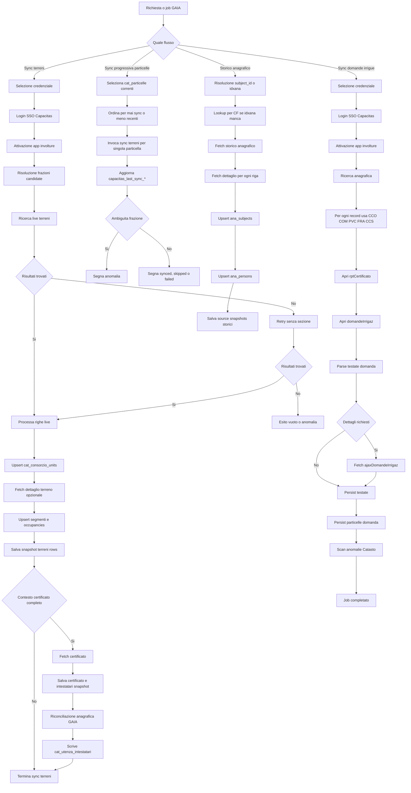

# Flusso Operativo Sync Capacitas

## Scopo

Questo file e una vista sintetica e operativa del flusso Capacitas nel dominio Catasto.

Per il dettaglio completo di tabelle, matching e codice, vedere:

- [CAPACITAS_SYNC_ANALYSIS.md](/home/cbo/CursorProjects/GAIA/domain-docs/catasto/docs/CAPACITAS_SYNC_ANALYSIS.md)

## Flussi principali

In GAIA oggi esistono quattro flussi distinti:

1. `sync terreni`
2. `sync progressiva particelle`
3. `import storico anagrafico`
4. `sync domande irrigue`

## Diagramma


```mermaid
flowchart TD
    A[Richiesta o job GAIA] --> B{Quale flusso}

    B -->|Sync terreni| T1[Selezione credenziale]
    T1 --> T2[Login SSO Capacitas]
    T2 --> T3[Attivazione app involture]
    T3 --> T4[Risoluzione frazioni candidate]
    T4 --> T5[Ricerca live terreni]
    T5 --> T6{Risultati trovati}
    T6 -->|No| T7[Retry senza sezione]
    T7 --> T8{Risultati trovati}
    T6 -->|Si| T9[Processa righe live]
    T8 -->|Si| T9
    T8 -->|No| T10[Esito vuoto o anomalia]
    T9 --> T11[Upsert cat_consorzio_units]
    T11 --> T12[Fetch dettaglio terreno opzionale]
    T12 --> T13[Upsert segmenti e occupancies]
    T13 --> T14[Salva snapshot terreni rows]
    T14 --> T15{Contesto certificato completo}
    T15 -->|Si| T16[Fetch certificato]
    T16 --> T17[Salva certificato e intestatari snapshot]
    T17 --> T18[Riconciliazione anagrafica GAIA]
    T18 --> T19[Scrive cat_utenza_intestatari]
    T15 -->|No| T20[Termina sync terreni]
    T19 --> T20

    B -->|Sync progressiva particelle| P1[Seleziona cat_particelle correnti]
    P1 --> P2[Ordina per mai sync o meno recenti]
    P2 --> P3[Invoca sync terreni per singola particella]
    P3 --> P4[Aggiorna capacitas_last_sync_*]
    P4 --> P5{Ambiguita frazione}
    P5 -->|Si| P6[Segna anomalia]
    P5 -->|No| P7[Segna synced, skipped o failed]

    B -->|Storico anagrafico| H1[Risoluzione subject_id o idxana]
    H1 --> H2[Lookup per CF se idxana manca]
    H2 --> H3[Fetch storico anagrafico]
    H3 --> H4[Fetch dettaglio per ogni riga]
    H4 --> H5[Upsert ana_subjects]
    H5 --> H6[Upsert ana_persons]
    H6 --> H7[Salva source snapshots storici]

    B -->|Sync domande irrigue| D1[Selezione credenziale]
    D1 --> D2[Login SSO Capacitas]
    D2 --> D3[Attivazione app involture]
    D3 --> D4[Ricerca anagrafica]
    D4 --> D5[Per ogni record usa CCO COM PVC FRA CCS]
    D5 --> D6[Apri rptCertificato]
    D6 --> D7[Apri domandeIrrigaz]
    D7 --> D8[Parse testate domanda]
    D8 --> D9{Dettagli richiesti}
    D9 -->|Si| D10[Fetch ajaxDomandeIrrigaz]
    D9 -->|No| D11[Persist testate]
    D10 --> D11
    D11 --> D12[Persist particelle domanda]
    D12 --> D13[Scan anomalie Catasto]
    D13 --> D14[Job completato]
```

## 1. Sync Terreni

### Input

Una richiesta tipica contiene:

- comune oppure frazione esplicita
- sezione
- foglio
- particella
- sub opzionale

### Sequenza

1. scelta credenziale attiva
2. login SSO Capacitas
3. attivazione app `involture`
4. risoluzione frazioni candidate
5. ricerca live terreni
6. retry senza sezione se la prima ricerca non trova nulla
7. risoluzione o creazione `cat_consorzio_unit`
8. fetch dettaglio terreno opzionale
9. creazione segmento riordino opzionale
10. creazione o update occupancy
11. salvataggio snapshot riga live
12. fetch certificato se il contesto e completo
13. salvataggio intestatari snapshot
14. tentativo di riconciliazione con anagrafica GAIA
15. scrittura link annuali `cat_utenza_intestatari`

### Output dati

Il flusso scrive soprattutto:

- `cat_consorzio_units`
- `cat_consorzio_unit_segments`
- `cat_consorzio_occupancies`
- `cat_capacitas_terreni_rows`
- `cat_capacitas_terreno_details`
- `cat_capacitas_certificati`
- `cat_capacitas_intestatari`
- `cat_utenza_intestatari`
- snapshot soggetto/persona in anagrafica centrale

## 2. Sync Progressiva Particelle

### Scopo

Questo flusso prende le `cat_particelle` locali e le passa una per una nella pipeline live terreni.

Non crea una logica diversa: orchestration sopra `sync terreni`.

### Selezione particelle

Il job lavora su:

- particelle correnti
- non soppresse
- mai sincronizzate oppure piu vecchie

Può essere limitato a:

- particelle `due`
- un numero massimo di record

### Esiti possibili

Su ogni particella locale il job aggiorna:

- `capacitas_last_sync_at`
- `capacitas_last_sync_status`
- `capacitas_last_sync_error`
- `capacitas_last_sync_job_id`

Stati attesi:

- `synced`
- `skipped`
- `failed`
- `anomalia`

### Caso speciale: frazione ambigua

Se una particella produce risultati validi in piu frazioni:

- il job non sceglie arbitrariamente
- salva anomalia sulla particella
- richiede risoluzione manuale

## 3. Import Storico Anagrafico

### Scopo

Questo flusso non sincronizza il catasto consortile.

Serve a popolare o completare lo storico persona in GAIA partendo da:

- `subject_id` locale
- oppure `idxana`

### Sequenza

1. risoluzione target
2. risoluzione `idxana` se manca
3. ricerca Capacitas per CF se necessario
4. fetch storico anagrafico
5. fetch dettaglio per ogni riga storica
6. creazione o update `AnagraficaSubject`
7. creazione o update `AnagraficaPerson`
8. scrittura snapshot storici come source snapshots

### Output dati

Aggiorna soprattutto:

- `ana_subjects`
- `ana_persons`
- storico snapshot persona sorgente Capacitas

## 4. Sync Domande Irrigue

### Scopo

Questo flusso importa le domande irrigue presentate su Capacitas inVOLTURE e le collega, quando possibile, a utenze, occupazioni e particelle locali.

Il lifecycle della domanda resta nel dominio Catasto. Il ruolo e solo un consumer di controllo e riconciliazione.

### Input

Il job parte da una o piu ricerche anagrafiche Capacitas:

- testo di ricerca `q`
- tipo ricerca Capacitas
- flag `solo_con_beni`
- opzioni job: `include_details`, `continue_on_error`, `deduplicate_contexts`, `auto_resume`

Per ogni record anagrafico si usa sempre il contesto Capacitas completo:

- `CCO`
- `COM`
- `PVC`
- `FRA`
- `CCS`

La lettera `D` finale nella colonna `Patrimonio` viene salvata come hint, ma non limita il perimetro: il backend verifica comunque tutti i record caricati dalla ricerca.

### Sequenza

1. scelta credenziale attiva
2. login SSO Capacitas
3. attivazione app `involture`
4. esecuzione di `ricercaAnagrafica.aspx`
5. deduplica opzionale per contesto `CCO + COM + PVC + FRA + CCS`
6. apertura di `rptCertificato.aspx` per inizializzare il contesto della scheda
7. apertura di `domandeIrrigaz.aspx`
8. parsing delle testate domanda
9. fetch opzionale dei dettagli particella tramite `ajaxDomandeIrrigaz.aspx`
10. upsert idempotente testate domanda
11. sostituzione controllata delle righe particella della domanda
12. matching best effort verso `cat_utenze_irrigue`, `cat_consorzio_occupancies`, `cat_consorzio_units` e `cat_particelle`
13. scansione anomalie dedicate

### Output dati

Il flusso scrive:

- `capacitas_domande_irrigue_sync_jobs`
- `cat_domande_irrigue`
- `cat_domanda_irrigua_particelle`
- `cat_anomalie`

### Anomalie dedicate

Il servizio dominio apre anomalie Catasto per:

- `DIR-01-superficie_coltura_superata`
- `DIR-02-superficie_totale_da_verificare`
- `DIR-03-domanda_fuori_termine`

La logica di superficie e conservativa e sempre per anno campagna: se piu domande insistono sulla stessa particella e stessa coltura nello stesso anno, la somma della superficie irrigua non deve superare la superficie catastale nota. La stessa particella puo comparire su domande o utenti diversi quando le colture o i periodi non si sovrappongono; i casi non classificabili restano da verificare come anomalia.

La scansione riconcilia anche lo stato delle anomalie: le `DIR-*` aperte non piu confermate nello scope scansionato vengono chiuse automaticamente.

Per `DIR-03` il termine ordinario di presentazione e il 30 aprile; carciofo, vigneto e oliveto usano il 30 giugno. Sono escluse dalla segnalazione le domande in autorinnovo e le domande composte solo da colture esenti da denuncia annuale, oggi agrumeto/frutteto.

### API operative

Job Capacitas, riservati a `super_admin`:

- `POST /elaborazioni/capacitas/involture/domande-irrigue/jobs`
- `GET /elaborazioni/capacitas/involture/domande-irrigue/jobs`
- `GET /elaborazioni/capacitas/involture/domande-irrigue/jobs/{job_id}`
- `POST /elaborazioni/capacitas/involture/domande-irrigue/jobs/{job_id}/run`
- `DELETE /elaborazioni/capacitas/involture/domande-irrigue/jobs/{job_id}`

Runbook minimo locale:

1. creare il job con uno o piu criteri di ricerca anagrafica Capacitas
2. lanciare il job con l'endpoint `/run`
3. monitorare `status`, `result_json.progress_percent`, `processed_rows`, `domande_seen`, `failed_items`
4. consultare i risultati su `/catasto/domande-irrigue` e la riconciliazione ruolo

Payload di esempio:

```json
{
  "searches": [
    {
      "q": "MDDMGV77A51G113Q",
      "tipo_ricerca": 2,
      "solo_con_beni": false
    }
  ],
  "include_details": true,
  "continue_on_error": true,
  "run_anomaly_checks": true,
  "deduplicate_contexts": true,
  "throttle_ms": 250,
  "auto_resume": true
}
```

Il job importa tutte le righe restituite da ogni ricerca configurata. Per run massivi usare criteri ampi solo dopo verifica locale, perche Capacitas limita la griglia e il job apre comunque ogni contesto `CCO + COM + PVC + FRA + CCS`.

Consultazione Catasto, per utenti attivi:

- `GET /catasto/domande-irrigue`
- `GET /catasto/domande-irrigue/summary`
- `GET /catasto/domande-irrigue/reconciliation/ruolo`
- `GET /catasto/domande-irrigue/{domanda_id}`

### UI

La consultazione operativa e disponibile in:

- `/catasto/domande-irrigue`

## Regole decisionali chiave

### 1. Il solo CCO non basta

Per certificati, intestatari e link Capacitas il backend considera affidabile il contesto:

- `CCO + COM + PVC + FRA + CCS`

Il solo `CCO` non e trattato come chiave sufficiente.

### 2. Capacitas non sostituisce il master locale

Capacitas oggi e una sorgente di:

- arricchimento
- verifica live
- riconciliazione

Non e il master di:

- `cat_utenze_irrigue`
- `cat_particelle`

### 2 bis. Domande irrigue come sottodominio Catasto

Per le domande irrigue il flusso resta separato in due livelli:

- adapter live in `backend/app/modules/elaborazioni/capacitas/apps/involture/domande_irrigue.py`
- persistenza e controlli di dominio in `backend/app/modules/catasto/services/domande_irrigue.py`

Il flusso operativo e:

1. partire dai record caricati da `ricercaAnagrafica.aspx`
2. aprire ogni contesto con `rptCertificato.aspx` usando `CCO + COM + PVC + FRA + CCS`
3. aprire `domandeIrrigaz.aspx`
4. parsare tutte le testate domanda e, se richiesto, i dettagli particella via `ajaxDomandeIrrigaz.aspx`
5. salvare testate in `cat_domande_irrigue`
6. salvare righe particella in `cat_domanda_irrigua_particelle`
7. generare anomalie Catasto per superficie/coltura e termini regolamentari

La lettera `D` finale in `Patrimonio` resta solo un hint: il backend verifica comunque tutti i record anagrafici.

### 3. Ambiguita = stop

Se il comune/frazione non e univoco:

- il backend non inventa il match
- il flusso si ferma con anomalia o errore esplicito

### 4. Match con utenza locale

Ordine logico:

1. cerca l’utenza locale con stesso `CCO`, anno e geografia
2. se l’anno non coincide, usa la piu recente con stessa geografia

### 5. Intestatari annuali solo su target affidabile

Se un certificato puo riferirsi a piu utenze locali:

- il backend evita di copiare intestatari su tutte

## Dove guardare quando qualcosa non torna

### Errore login o credenziali

- [backend/app/services/elaborazioni_capacitas.py](/home/cbo/CursorProjects/GAIA/backend/app/services/elaborazioni_capacitas.py:96)
- [backend/app/modules/elaborazioni/capacitas/session.py](/home/cbo/CursorProjects/GAIA/backend/app/modules/elaborazioni/capacitas/session.py:60)

### Problema lookup comune/frazione/sezione

- [backend/app/services/elaborazioni_capacitas_terreni.py](/home/cbo/CursorProjects/GAIA/backend/app/services/elaborazioni_capacitas_terreni.py:1257)

### Problema match particella locale / comune reale

- [backend/app/services/elaborazioni_capacitas_terreni.py](/home/cbo/CursorProjects/GAIA/backend/app/services/elaborazioni_capacitas_terreni.py:1950)

### Problema certificato o intestatari

- [backend/app/services/elaborazioni_capacitas_terreni.py](/home/cbo/CursorProjects/GAIA/backend/app/services/elaborazioni_capacitas_terreni.py:230)
- [backend/app/services/elaborazioni_capacitas_terreni.py](/home/cbo/CursorProjects/GAIA/backend/app/services/elaborazioni_capacitas_terreni.py:305)

### Problema sync progressiva particelle

- [backend/app/services/elaborazioni_capacitas_particelle_sync.py](/home/cbo/CursorProjects/GAIA/backend/app/services/elaborazioni_capacitas_particelle_sync.py:217)

### Problema storico anagrafico

- [backend/app/services/elaborazioni_capacitas_anagrafica_history.py](/home/cbo/CursorProjects/GAIA/backend/app/services/elaborazioni_capacitas_anagrafica_history.py:258)

## Messaggio finale

Il modello operativo corretto e:

- `cat_utenze_irrigue` e il dato consortile locale di base
- Capacitas aggiunge il contesto live e i certificati
- il backend cerca di collegare i due mondi senza forzare i casi dubbi
- gli snapshot live vengono mantenuti per audit, recupero e consultazione
