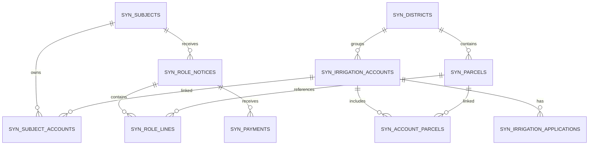

# GAIA Data MCP — schema sintetico proposto

> Proposta iniziale. Validare contro `GAIA_DATA_MCP_ANALYSIS.md` prima di implementare.

## Obiettivo

Creare uno schema sufficientemente complesso da supportare interrogazioni realistiche senza utilizzare dati reali.

## Entità

### `syn_subjects`
- `id` UUID PK
- `subject_type` enum: person/company
- `display_name`
- `synthetic_identifier` unique
- `municipality`
- `status`

### `syn_districts`
- `id` UUID PK
- `code` unique
- `name`
- `active`

### `syn_parcels`
- `id` UUID PK
- `municipality_code`
- `sheet`
- `parcel_number`
- `subaltern`
- `district_id` FK
- `area_ha`
- `crop`
- unique `(municipality_code, sheet, parcel_number, subaltern)`

### `syn_irrigation_accounts`
- `id` UUID PK
- `account_code` unique
- `status`
- `campaign_year`
- `district_id` FK nullable
- `irrigated_area_ha`

### `syn_subject_accounts`
M:N soggetto ↔ utenza:
- `subject_id` FK
- `account_id` FK
- `role` enum: holder/coholder/delegate

### `syn_account_parcels`
M:N utenza ↔ particella:
- `account_id` FK
- `parcel_id` FK
- `irrigated_area_ha`
- `valid_from_year`
- `valid_to_year`

### `syn_irrigation_applications`
- `id` UUID PK
- `application_code` unique
- `account_id` FK
- `campaign_year`
- `status`
- `submitted_at`

### `syn_role_notices`
- `id` UUID PK
- `notice_code` unique
- `subject_id` FK
- `tax_year`
- `account_code` nullable
- `total_amount`
- `status`

### `syn_role_lines`
- `id` UUID PK
- `notice_id` FK
- `parcel_id` FK nullable
- `tribute_code`
- `maintenance_amount`
- `irrigation_amount`
- `institutional_amount`

### `syn_payments`
- `id` UUID PK
- `notice_id` FK
- `paid_at`
- `amount`
- `method`
- `status`

## ER diagram

## Dataset iniziale

Target suggerito:
- 300 soggetti;
- 450 utenze;
- 1.000 particelle;
- 8–15 distretti sintetici;
- 600 relazioni soggetto-utenza;
- 1.500 relazioni utenza-particella;
- 500 domande irrigue;
- 800 avvisi su almeno 3 annualità;
- 1.500 righe di ruolo;
- 500 pagamenti.

## Casi deliberatamente presenti

- omonimi;
- soggetti con più utenze;
- utenze con più intestatari;
- particelle associate a più utenze in anni diversi;
- avvisi senza pagamento;
- pagamenti parziali;
- avvisi completamente pagati;
- record non trovati;
- particelle senza ruolo;
- ruolo riferito a particella non più attiva;
- combinazioni che richiedono 2–4 tool call.

## Seed

Il generatore deve accettare `GAIA_SYNTHETIC_SEED`.

## Identificativi

Non usare codici fiscali, P.IVA o riferimenti catastali reali copiati dai sistemi del Consorzio.

## Geometrie

Nella v1 non è necessaria la replica completa PostGIS. È sufficiente modellare comune, distretto e relazioni particella-distretto.
